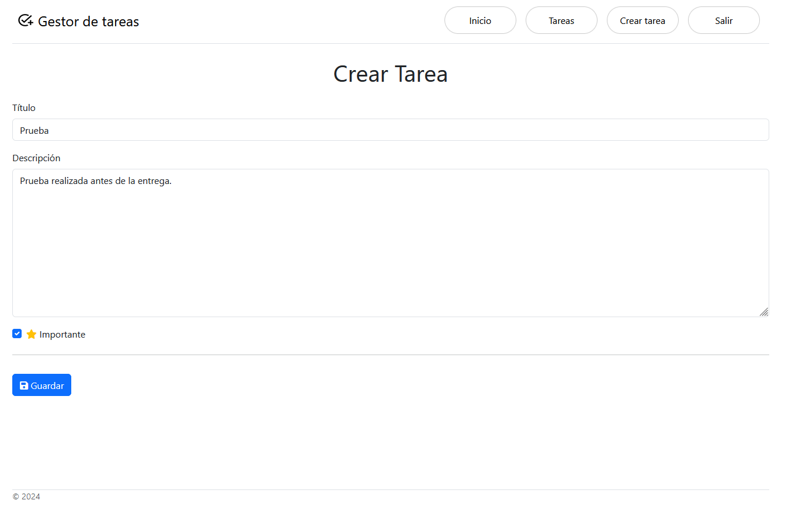

# Task Management App


## Descripción

La **Task Management App** es una aplicación web diseñada para gestionar tareas. Permite a los usuarios crear, leer, actualizar y eliminar tareas. Además, cada tarea puede ser marcada como importante. La interfaz está construida usando Django y Bootstrap para asegurar una experiencia de usuario moderna y receptiva.

## Características

- **Crear Tareas**: Los usuarios pueden añadir nuevas tareas con título, descripción, y marcar si es importante.
- **Leer Tareas**: Visualización de todas las tareas creadas en un listado.
- **Actualizar Tareas**: Los usuarios pueden editar los detalles de las tareas.
- **Eliminar Tareas**: Funcionalidad para eliminar tareas no deseadas.
- **Completar Tareas**: Marcar tareas como completadas.
- **Gestión de Subtareas**: Cada tarea puede tener subtareas asociadas.
- **Interfaz Intuitiva**: Construida con Bootstrap para una apariencia moderna y funcional.

## Requerimientos

- **Python 3.12.x**: Asegúrate de tener instalada una versión reciente de Python.
- **Django 5.0.x**: Framework web utilizado para la aplicación.
- **Bootstrap 5**: Framework CSS utilizado para el diseño de la interfaz.
- **SQLite**: Base de datos por defecto para desarrollo.

## Instalación

1. Clona el repositorio:

    ```bash
    git clone https://github.com/iamfredd/app_tasks.git
    cd task-management-app
    ```

2. Crea y activa un entorno virtual:

    ```bash
    python -m venv env
    source env/bin/activate  # En Windows usa `env\Scripts\activate`
    ```

3. Instala las dependencias:

    ```bash
    pip install -r requirements.txt
    ```

4. Realiza las migraciones de la base de datos:

    ```bash
    python manage.py migrate
    ```

5. Inicia el servidor de desarrollo:

    ```bash
    python manage.py runserver
    ```

6. Abre tu navegador y ve a `http://127.0.0.1:8000` para ver la aplicación en acción.

## Uso

1. **Página de Inicio**: Una vez que inicies la aplicación, serás recibido con una página de bienvenida que incluye botones para iniciar sesión o registrarse.
2. **Gestión de Tareas**: Después de iniciar sesión, podrás ver, crear, actualizar y eliminar tareas desde la página principal de tareas.
3. **Completar Tareas**: Marca las tareas como completadas directamente desde el listado de tareas.

## Capturas de Pantalla

### Página de Inicio


### Listado de Tareas


### Formulario de Creación de Tareas



### Formulario de Detalle de Tarea Pendiente


### Formulario de Detalle


## Contribución

Si deseas contribuir al proyecto, por favor realiza un fork del repositorio y crea una nueva rama para tus características o arreglos. Luego, realiza un pull request para que podamos revisar tus cambios.